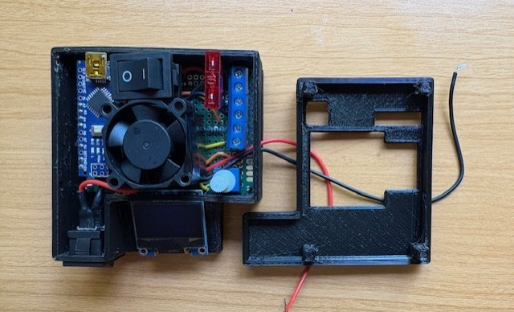

# Heated Bed Controller for 3d Printer

## Summary

### Backstory

  While creating my DIY 3d printer, I've run into several roadblocks along the way. One of which being the temperature read and controlled output of the 3d printers heated bed. Currently, the main controls of my printer (for motor drivers, hotend, LCD display) are run on an arduino mega accompanied by a modified RAMPs 1.4 shield operating at 24 volts (marlin firmware). For whatever reason, after every attempt to drive the heated bed through RAMPs 1.4, my printer would run into several performance issues:
    - Inaccurate readings from bed thermistor
    - Bed continuously heating up, runaway temps well past desired temperature
    - Miscellaneous lapse in readings from hotend thermistor causing hotend temp runaways causing print failures (but only when bed was attached)

  Whether it was the RAMPs 1.4 shield itself, or the bed not playing well with my current setup, I decided to build an additional system to read heated bed temps, set, and hold bed temps via PID Control.

### Reading Temperature

  In order to measure temps, the arduino must measure the voltage at the point past the thermistor and another "known" resistor (voltage-divider). The resistance of the thermistor embedded in my heated bed is approximately 100k ohms. A 100k ohm pull-down resistor is set up and an analog pin is set and gets fed back the voltage at the point past the thermistor + pull-down resistor [see circuit diagram](Circuit_Diagram_Link_Here).

  The [Steinhart–Hart equation](https://en.wikipedia.org/wiki/Steinhart%E2%80%93Hart_equation) is used to calculate temperature from the resistance reading on the thermistor.

### Controlling Temperature

  A modified [PID control algorithm](https://en.wikipedia.org/wiki/Proportional%E2%80%93integral%E2%80%93derivative_controller) is used to balance temperatures around a setpoint, where setpoint is the desired temperature and is set via potentiometer.

  The standard output range on the Arduino PWM pin allows for values between 0 - 255. For my purposes, this range in temperature (degrees fahrenheit) works fine, but if higher temps are required I'd recommend driving MOSFET gate by another means (analog pin, optocoupler, etc).

  Arduino drives MOSFET by sending PWM-capped PID values to the MOSFET gate pin (protected by 330R resistor). MOSFET then controls the flow of current from the 24v external power supply to the heated bed, heating it up (Arduino and MOSFET share ground).

  *Warning:* The values saved in [main.cpp](https://github.com/Morfeam/HeatedBed/blob/main/src/main.cpp) were consistently off approx. 3 degrees fahrenheit of the actual temperature measured by the thermistor and another thermometer used to get a baseline reading of actual temps. A 3 degree fahrenheit error margin is acceptable for my purposes, but it's important to tune the Kp, Ki, and Kd values specific for your setup.

### Output To Display

  OLED display uses I2C protocol and serial communication is handled via Adafruit_SSD1306 library to write relevant data to display.

  Display data key:
  Set: *The current set temperature by potentiometer*
  Read: *The current temperature read from thermistor*
  PiD: *current PID value (capped between 0-255 for PWM)*
  Time: *time elapsed in milliseconds*

## Material List

- 1x 50mm x 70mm PCB Prototype Board
- 1x 10 Amp Fuse
- 1x IRF3205 MOSFET
- Solid Core / Jumper Wires (22 AWG)
- 1x Arduino Nano (ATmega328P)
- 1x 10K ohm Resistor
- 1x 330R ohm resistor
- 1x 10K potentiometer
- 2x 250V 10A Switches
- 1x Small OLED Display (I2C)
- 3x 2 pin PCB mount screw terminals
- Heatsink for MOSFET
- 2x spade connectors
- Small 12v fan
- 24v heated bed + 100K thermistor
- Soldering setup (iron, solder, etc.)
- External power supply (a means of powering both arduino and heated bed)

#### Optional Materials

- Heat Shrink tubing
- 3d printer and PLA filament (for housing)
- Solder flux paste to make better contacts

## Future Enhancements

- Streamline everything to run 12 volts
  - Currently, my heated bed takes 24 volts while my arduino microcontroller can only support an operating voltage range between 7 - 12 volts.
  - In my case, this isn't too big of an issue, as I already have several components in my DIY printer that require both 12 and 24 volts. However, in the future it would be ideal to have all components functioning at the same voltage.
  - Steamling voltage would reduce complexity of wiring and remove the need for additional power supply / buck converter for arduino.

- Updates to 3d models
  - Models could be updated to better fit the form factor of my printer's design.

- Kicad circuit design to fully milled PCB
    - instead of using wires, this could be done on a custom milled circuit board for reliability, repeatability, and appearance
